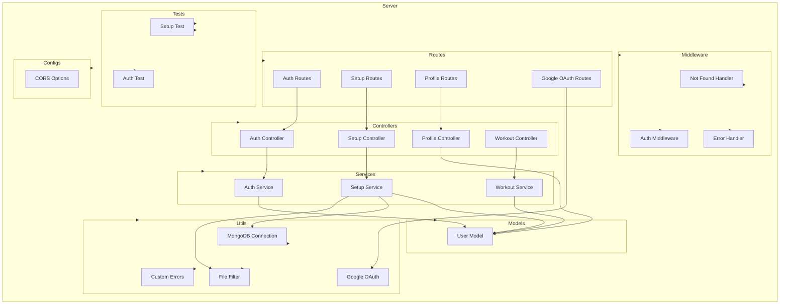

    

    <b>Automatic Architecture Diagrams from Code</b> 
    <a href="https://github.com/swark-io/swark">GitHub</a> • <a href="https://swark.io">Website</a> • <a href="mailto:contact@swark.io">Contact Us</a>

## Usage Instructions

1. **Render the Diagram**: Use the links below to open it in Mermaid Live Editor, or install the [Mermaid Support](https://marketplace.visualstudio.com/items?itemName=bierner.markdown-mermaid) extension.
2. **Recommended Model**: If available for you, use `claude-3.5-sonnet` [language model](vscode://settings/swark.languageModel). It can process more files and generates better diagrams.
3. **Iterate for Best Results**: Language models are non-deterministic. Generate the diagram multiple times and choose the best result.

## Generated Content
**Model**: GPT-4o - [Change Model](vscode://settings/swark.languageModel)  
**Mermaid Live Editor**: [View](https://mermaid.live/view#pako:eNqNVs1u2zAMfhVD5_YFchiwNct2STM0KXawd_BixjFmS4Z-VgxF332SKEeULaPNoeDPJ5EfRdJ9ZWfRANuwireyHq_FaVvxwv6U-Y2GI8i_INGYOPZd0_TwUkuITvfjQu-E4U35KHThpeJ7zS1U_kqBIKWQwVV-dcoKsDb6GqOVn61KohMw8CaT6JMwGtTySrTjdSjP4irQZgyoo5PzsFGKS9dDAP5ALQ9thWhvyG9eKQ75BPJcHgTXUvS2RhlC0Ymkop4jRtBIbhUeCJIDE8nVIy9C_rGMyJGfaMkfyZN1rdedc08XPEgzKDmOEw4J5oEh1Qk65bkE55N81l0_y_AsOIezPom94K0o_d_tF8fcmTvBs13h-yBpihnMVXzX9doWc-eKj3JuqFT5YJQWQ-Gn6v2u2tsdMCdhFEhvL5-thJCPtOelaxflkOowOt42r8PTsQjKu7edQGmVeVVnD0_qxMy28AjfHDPALZAXUMQNV9zff1rsNOKiW4SYFwNJfGn_EgfpGRqcvEIaIdaU2EN10B73mfel2yBs9LjNPGa2BBCU7DIPWww_Aukm8zjSxDSpeO6WWCgLyWoGoqObpDXD3VoUQYud40HpeNPUgil3Fc3gQ_505FdAcYCThFfiICZ2pPdPH9esk35Qs4D0QzqF8N24yiJ6kxdOXXNm0YP7aArleza-sVPnjml8K87u2AByqLvG_n_yWjF9hQEqtikq1sClNr2u2JsFmbGpNWy72m6NgW20NHDH7DXi-I-fJ10K017Z5lL3Ct7-A3ji4GE) | [Edit](https://mermaid.live/edit#pako:eNqNVs1u2zAMfhVD5_YFchiwNct2STM0KXawd_BixjFmS4Z-VgxF332SKEeULaPNoeDPJ5EfRdJ9ZWfRANuwireyHq_FaVvxwv6U-Y2GI8i_INGYOPZd0_TwUkuITvfjQu-E4U35KHThpeJ7zS1U_kqBIKWQwVV-dcoKsDb6GqOVn61KohMw8CaT6JMwGtTySrTjdSjP4irQZgyoo5PzsFGKS9dDAP5ALQ9thWhvyG9eKQ75BPJcHgTXUvS2RhlC0Ymkop4jRtBIbhUeCJIDE8nVIy9C_rGMyJGfaMkfyZN1rdedc08XPEgzKDmOEw4J5oEh1Qk65bkE55N81l0_y_AsOIezPom94K0o_d_tF8fcmTvBs13h-yBpihnMVXzX9doWc-eKj3JuqFT5YJQWQ-Gn6v2u2tsdMCdhFEhvL5-thJCPtOelaxflkOowOt42r8PTsQjKu7edQGmVeVVnD0_qxMy28AjfHDPALZAXUMQNV9zff1rsNOKiW4SYFwNJfGn_EgfpGRqcvEIaIdaU2EN10B73mfel2yBs9LjNPGa2BBCU7DIPWww_Aukm8zjSxDSpeO6WWCgLyWoGoqObpDXD3VoUQYud40HpeNPUgil3Fc3gQ_505FdAcYCThFfiICZ2pPdPH9esk35Qs4D0QzqF8N24yiJ6kxdOXXNm0YP7aArleza-sVPnjml8K87u2AByqLvG_n_yWjF9hQEqtikq1sClNr2u2JsFmbGpNWy72m6NgW20NHDH7DXi-I-fJ10K017Z5lL3Ct7-A3ji4GE)

